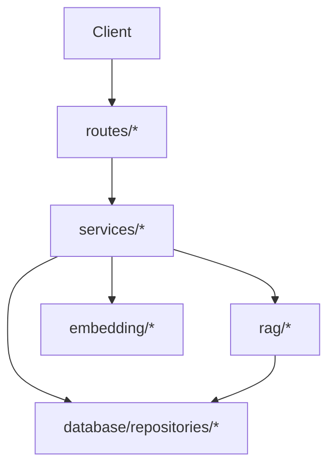

# `api/`

Main backend service (auth, chat/search, ingest).

## Modules
- `main.py`: FastAPI app bootstrap and router wiring.
- `routes/`: HTTP endpoints.
- `services/`: app-level business logic.
- `llm/`: LLM provider adapters.
- `rag/`: RAG query routing/retrieval pipeline.
- `database/`: SQLAlchemy models/session/repositories.
- `embedding/`: embedding provider runtime (TEI/Ollama).
- `rag_service/`: standalone RAG microservice boundary.

## Flow


## Run
```bash
python main.py
```

## TEI Endpoint
Use a single TEI URL (prefer LB/service mesh in front of multiple replicas):
```bash
TEI_URL=http://tei-lb:7860
```
