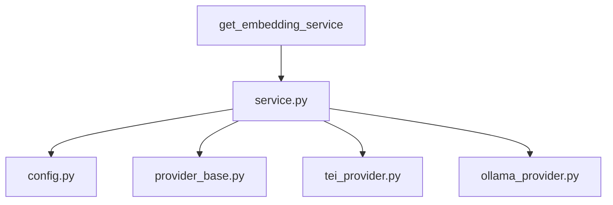

# `embedding/`

Embedding domain split by provider and lifecycle.

## Modules
- `runtime.py`: compatibility exports.
- `service.py`: provider selection + singleton access.
- `config.py`: env configuration parsing.
- `provider_base.py`: provider interface.
- `tei_provider.py`: TEI implementation.
- `ollama_provider.py`: Ollama implementation.
- `providers.py`: provider export surface.

## Flow

## Relevance
- `service.py` is the single entrypoint used by app code.
- provider files isolate infra-specific logic.
- `runtime.py` preserves old import paths.
