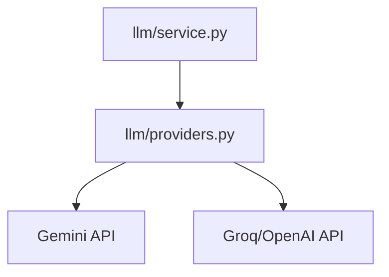

# `llm/`

LLM domain (single entrypoint + providers).

## Modules
- `service.py`: provider selection/env validation (`LLMService`, `get_llm_service`).
- `providers.py`: Gemini/OpenAI-compatible provider adapters (`stream(prompt)`).

## Flow

