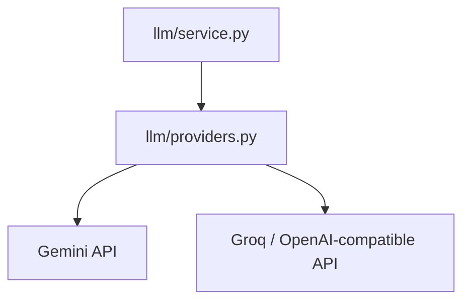

# `llm/`

LLM domain (single entrypoint + providers).

## Modules
- `service.py`: provider selection/env validation (`LLMService`, `get_llm_service`).
- `providers.py`: Gemini and OpenAI-compatible provider adapters
  (`stream(prompt)`). Groq uses the OpenAI-compatible adapter with Groq's base
  URL.

## Flow

```mermaid
flowchart TD
  A[llm/service.py] --> B[llm/providers.py]
  B --> C[Gemini API]
  B --> D[Groq / OpenAI-compatible API]
```

## Environment

- `LLM_PROVIDER=gemini` (default), `groq`, or `openai`.
- Gemini: `GEMINI_API_KEY`, optional `GEMINI_MODEL`.
- Groq: `GROQ_API_KEY`, optional `GROQ_MODEL`.
- OpenAI-compatible: `OPENAI_API_KEY`, optional `OPENAI_MODEL`,
  optional `OPENAI_BASE_URL` (can point at a compatible gateway).
