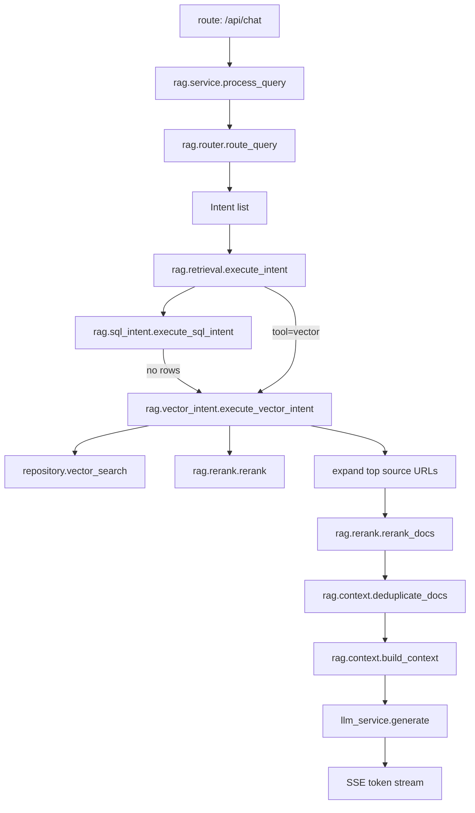

# `rag/`

RAG domain internals (no black box).

## Modules
- `service.py`: `RAGService` public API (`process_query`, `search_courses`, `stream_answer`).
- `router.py`: LLM router output -> intent list.
- `retrieval.py`: executes each intent (`sql` first, vector fallback).
- `sql_intent.py`: filter normalization and SQL filter execution.
- `vector_intent.py`: vector search, source expansion, rerank orchestration.
- `rerank.py`: Jina rerank API + local fallback ranking.
- `context.py`: dedupe + context formatting for final answer prompt.

## Entry Points
- `/api/chat` -> `RAGService.process_query`
- `/api/search` -> `RAGService.search_courses`
- `/api/ask` -> `RAGService.stream_answer`

## Full Flow (`/api/chat`)

## Fallback Rules
- Router JSON parse fails -> single vector intent.
- SQL intent returns nothing -> vector path with repaired query.
- Rerank API unavailable -> index-order fallback.
- No retrieved docs -> fixed apology response.

## Output Shapes
- `/api/chat`: SSE chunks from `llm_service.generate`.
- `/api/search`: JSON list of course hits + timing.
- `/api/ask`: SSE with `courses` metadata, `chunk` tokens, `done`.
