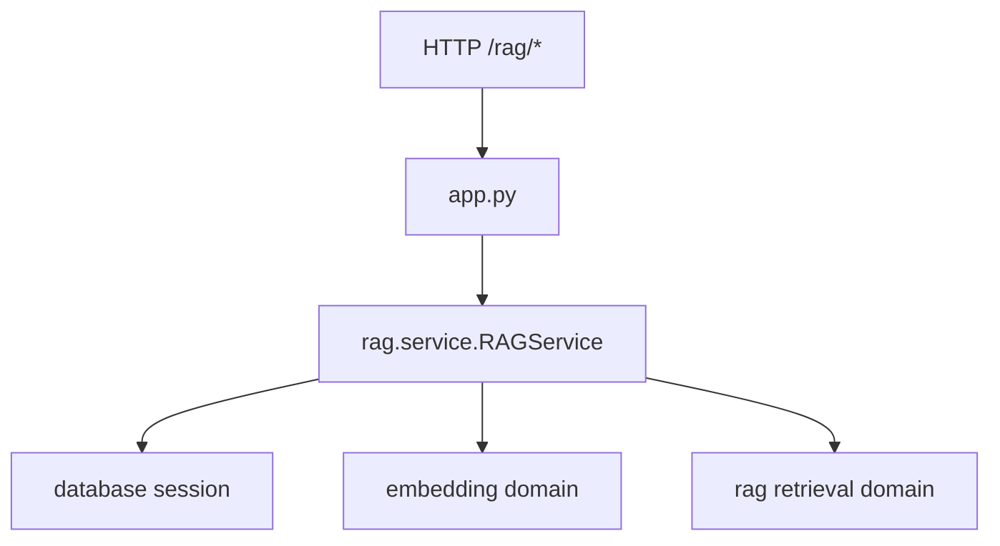

# `rag_service/`

Standalone RAG microservice shell.

## Modules
- `app.py`: FastAPI app + RAG endpoints.
- `Dockerfile`: container runtime.
- `requirements.txt`: dependency input.

## Flow

## Relevance
- deploy boundary for RAG as a separate service.
- keeps same models/session layer as monolith.
