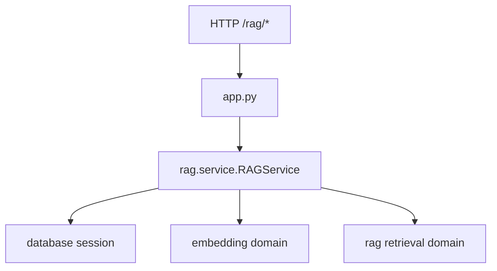

# `rag_service/`

Optional standalone RAG microservice shell. The main application uses the
monolith entrypoint in `api/main.py`; this package is a deploy boundary for
running the same RAG service separately.

## Modules
- `app.py`: FastAPI app + RAG endpoints.
- `Dockerfile`: container runtime.
- `requirements.txt`: dependency input.

## Flow

```mermaid
flowchart TD
  A[HTTP /rag/*] --> B[app.py]
  B --> C[rag.service.RAGService]
  C --> D[database session]
  C --> E[embedding domain]
  C --> F[rag retrieval domain]
```

## Relevance
- deploy boundary for RAG as a separate service;
- keeps the same models/session layer as the monolith;
- should stay thin and import `RAGService` from `rag.pipeline`, not duplicate
  retrieval logic.
