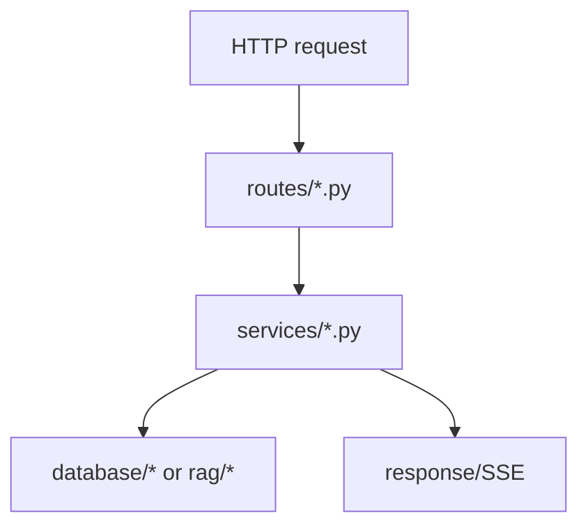

# `routes/`

HTTP entrypoints only. Keep route files thin.

## Modules
- `auth.py`: register/login/me/refresh.
- `logout.py`: logout endpoint (cookie invalidation).
- `search.py`: chat/search/ask endpoints.

## Flow

## Rule
- Validate request/identity in routes.
- Put business logic in `services/`.
