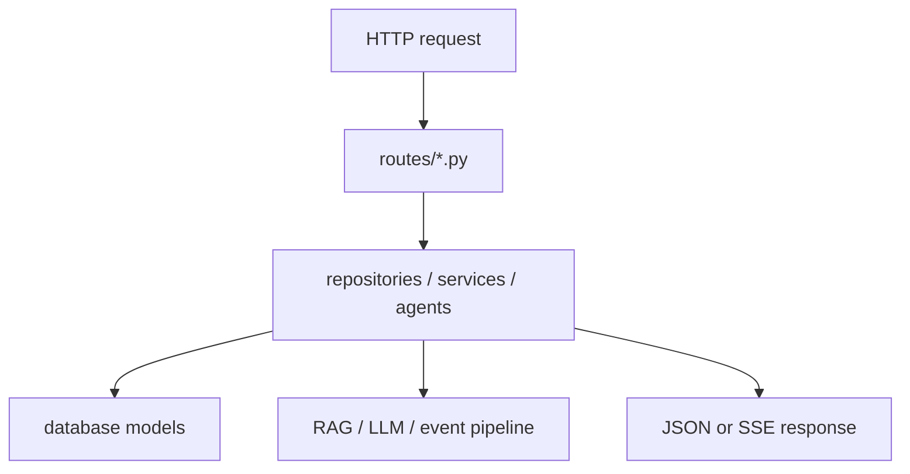

# `api/routes/`

HTTP entry points only. Route files should validate identity/request shape,
call repositories/services/agents, and return API payloads. Business logic
belongs outside this directory when it grows beyond request orchestration.

## Modules

- `auth.py`: register, login, current user, refresh.
- `logout.py`: auth-cookie invalidation.
- `search.py`: `/chat`, `/search`, `/ask` RAG endpoints.
- `sis.py`: academic calendar and current-student schedule.
- `student.py`: dashboard, profile, transcript, enrolled courses.
- `events.py`: admin event extraction trigger, run status, telemetry,
  candidate logs.
- `regulations.py`: current user's precomputed regulation assignments and
  assignment status updates.
- `assignments.py`: student assignment listing, upload, streaming submission
  review, and flag-for-review path.

## Flow

```mermaid
flowchart TD
  A[HTTP request] --> B[routes/*.py]
  B --> C[repositories / services / agents]
  C --> D[database models]
  C --> E[RAG / LLM / event pipeline]
  C --> F[JSON or SSE response]
```

## Boundary Notes

- `/api/events/*` exposes extraction-run telemetry over `regulatory_events`.
- `/api/regulations/me` reads `user_rule_assignments` joined to
  `regulation_rules`.
- Assignment submission review uses `agents/submission_agent.py`; the streaming
  route emits Server-Sent Events and then persists the final submission row.
