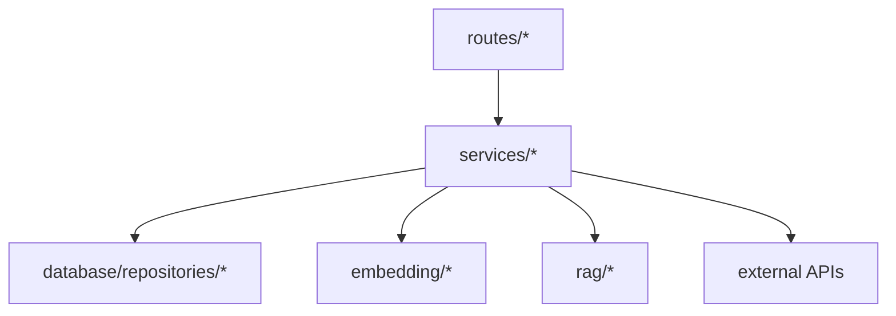

# `services/`

Business logic layer used by routes.

## Modules
- `auth_service.py`: password hashing, token issue/verify, user auth.
- `rag_service.py`: compatibility export to `rag.service.RAGService`.
- `embedding_service.py`: compatibility export to `embedding.service`.

## Flow

## Rule
- Keep service files focused and small.
- Route code calls services; services own decision logic.

## LLM Switching
- `LLM_PROVIDER`: `gemini` | `groq` | `openai`
- Gemini: `GEMINI_API_KEY`, optional `GEMINI_MODEL`
- Groq: `GROQ_API_KEY`, optional `GROQ_MODEL`
- OpenAI: `OPENAI_API_KEY`, optional `OPENAI_MODEL`, optional `OPENAI_BASE_URL`
- Runtime reload supported via `llm.service.get_llm_service().reload_from_env()`
